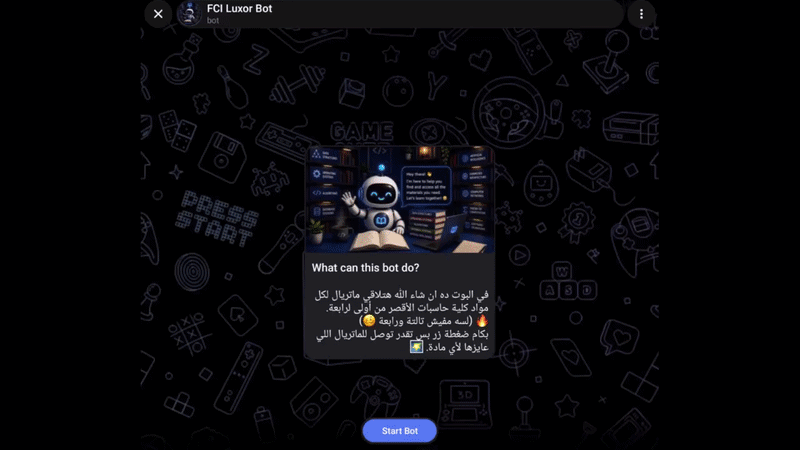

# CooligBot

A Telegram bot that provides quick and organized access to course materials for students of the Faculty of Computers and Information, Luxor University.

> This project is independent and is **not affiliated with or endorsed by the college.**

## 🤖 Bot

**Username:** `@fci_coolig28_bot`

You can access the bot directly by searching for its username on Telegram.

## ✨ Features

- 📖 Browse materials by:
  - Academic year
  - Department
  - Semester
  - Course
- 📂 Access different resource types:
  - Lectures
  - Summaries
  - Exams
  - Videos
- Instantly send files using Telegram File IDs
- Store courses and resources using SQLite
- Admin tools for managing courses, materials, and video links
- Built with asynchronous Python

## 🛠️ Tech Stack

- **Python**
- **pyTelegramBotAPI**
- **SQLite**
- **aiosqlite**
- **python-dotenv**

## 📸 Preview

## 🎯 Purpose

The goal of this project is to make course materials easier to access through a simple Telegram interface, eliminating the need to search through multiple chats, channels, or folders.
